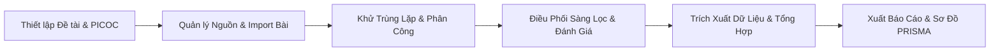

# Cẩm Nang Chi Tiết Về Vai Trò Project Leader (Trưởng Nhóm Đề Tài SLR)

Tài liệu này tổng hợp toàn bộ các tuyến đường (Routes), quyền hạn, chức năng và quy trình vận hành mà một người dùng giữ vai trò **Project Leader (Trưởng nhóm đề tài)** sở hữu trong Hệ thống Theo dõi Xu hướng & Tổng quan Tài liệu Khoa học (**SLRS**).

---

## 1. Tổng Quan Về Vai Trò Project Leader

Trong phương pháp luận nghiên cứu **Systematic Literature Review (SLR)**, **Project Leader** (hoặc Project Owner) đóng vai trò là "Tổng công trình sư" của đề tài:
* Thiết lập mục tiêu, phạm vi và câu hỏi nghiên cứu (Research Protocol).
* Quản lý thành viên, phân quyền và giao việc cho các phản biện (Reviewers).
* Điều phối kho bài báo (Paper Pool), khử trùng lặp và phân chia bài.
* Giám sát tiến độ 5 giai đoạn SLR: *Identification -> Screening -> Quality Assessment -> Data Extraction -> Synthesis*.
* Giải quyết các bất đồng ý kiến (Conflict Resolution / Consensus).
* Xuất sơ đồ dòng chuẩn **PRISMA 2020** và báo cáo nghiên cứu hoàn chỉnh.

---

## 2. Bản Đồ Tuyến Đường (Route Map) Dành Cho Project Leader

| Đường dẫn (Route URL) | Tên Component | Mục đích & Chức năng của Leader |
| :--- | :--- | :--- |
| `/projects` | `ProjectListPage` | Xem danh sách các đề tài mình đang dẫn dắt hoặc tham gia; tạo đề tài mới. |
| `/projects/:id/overview` | `ProjectDetailPage` | Trang chủ đề tài: Xem thông tin chung, trạng thái kích hoạt, hồ sơ đề cương (Setup Summary). |
| `/projects/:id/workspace/:stepId` | `PaperPoolTab` | Không gian làm việc quản trị kho bài báo qua **5 bước chuẩn bị** (`stepId` từ 1 đến 5). |
| `/projects/:id/settings` | `ProjectSettingsPage` | Cài đặt đề tài: Mời thành viên mới, phân vai trò (Leader/Reviewer), xóa thành viên, cập nhật ngày tháng. |
| `/projects/:id/audit-logs` | `ProjectAuditLogPage` | Xem nhật ký kiểm toán riêng của dự án (theo dõi ai đã sàng lọc bài nào, khi nào). |
| `/projects/:id/workspace` hoặc `.../processes/:processId` | `ReviewProcessWorkspace` | Trung tâm điều khiển quy trình phản biện: Bắt đầu, hoàn thành, đóng/mở từng giai đoạn phản biện. |
| `/projects/:id/identification` | `IdentificationPhaseWorkspace` | Giai đoạn 1: Quản lý nguồn tìm kiếm, số lượng bài thu thập, chuỗi truy vấn (Search string). |
| `/projects/:id/screening/dashboard` | `ManageStudySelectionPage` | Giai đoạn 2: Bảng điều khiển phân công phản biện bài báo và giám sát tiến độ sàng lọc. |
| `.../screening/:processId/papers-statistic` | `StuSePaperStatisticPage` | **(Chỉ Leader - Role 1)** Thống kê chi tiết tỷ lệ bài Included/Excluded theo từng Reviewer. |
| `/projects/:id/screening/full-text` | `FullTextScreeningWorkspace` | Sàng lọc bài báo giai đoạn Toàn văn (Full-text screening) & giải quyết xung đột ý kiến. |
| `/projects/:id/quality-assessment` | `QualityAssessmentWorkspace` | Giai đoạn 3: Cấu hình bộ câu hỏi đánh giá chất lượng (QA Checklist) và chấm điểm bài báo. |
| `/projects/:id/extraction` | `DataExtractionPhaseWorkspace` | Giai đoạn 4: Thiết kế biểu mẫu trích xuất dữ liệu và theo dõi việc trích xuất từ các bài báo nhận. |
| `/projects/:id/extraction/grid` | `ExtractionGridWorkspace` | Xem bảng lưới ma trận trích xuất dữ liệu tổng hợp của tất cả các bài báo. |
| `/projects/:id/synthesis/*` | `SynthesisPhaseWorkspace` | Giai đoạn 5: Thiết lập chiến lược tổng hợp (định tính/định lượng) và tổng hợp kết quả nghiên cứu. |
| `/projects/:id/prisma-report` | `PrismaReportWorkspace` | Xuất sơ đồ dòng chảy PRISMA Flow Diagram 2020 và xuất báo cáo kết quả hoàn chỉnh. |

---

## 3. Chi Tiết Các Nhóm Chức Năng Cốt Lõi Của Project Leader

### 3.1. Thiết Lập Đề Tài & Trợ Lý AI (AI-assisted Setup Wizard)
* **Khung PICO-C**: Leader trực tiếp nhập hoặc dùng AI (Gemini) để sinh tự động:
  - **P (Population)**: Đối tượng nghiên cứu.
  - **I (Intervention)**: Công nghệ hoặc giải pháp mới.
  - **C (Comparator)**: Giải pháp truyền thống đối chứng.
  - **O (Outcome)**: Kết quả đo lường, chỉ số đánh giá.
  - **C (Context)**: Bối cảnh áp dụng.
* **Câu hỏi nghiên cứu (Research Questions - RQs)**: Leader phê duyệt, thêm mới, sửa hoặc xóa các câu hỏi nghiên cứu mà đề tài cần trả lời.
* **Kích hoạt dự án**: Chuyển trạng thái dự án từ `Draft` sang `Active`.

### 3.2. Quản Trị Kho Bài Báo (Paper Pool Management - 5 Bước)
Thanh tiến trình `PoolWorkflowStepper` hướng dẫn Leader qua 5 giai đoạn:
1. **Bước 1 — Research Strategy**: Rà soát lại RQs và PICO-C đã định nghĩa.
2. **Bước 2 — Search Strategy**: Cấu hình các cơ sở dữ liệu học thuật (IEEE, Scopus, ACM, PubMed,...).
3. **Bước 3 — Paper Repository**:
   - Nhập bài báo hàng loạt từ file `.bib`, `.ris`.
   - Tìm nạp trực tiếp qua mã DOI hoặc API Crossref, OpenAlex, Semantic Scholar.
4. **Bước 4 — Review Process**: Khởi tạo quy trình phản biện.
5. **Bước 5 — Select & Assign**:
   - Khử trùng lặp (Deduplication) bài báo tự động.
   - Chạy Snowballing (thu thập tài liệu trích dẫn ngược/xuôi).
   - Phân công các bài báo cho các Reviewer trong nhóm.

### 3.3. Điều Phối Quy Trình Phản Biện (Review Process Control)
Chỉ **Project Leader** mới có quyền thực hiện các nút bấm điều khiển vòng đời nghiên cứu:
* **Khởi động / Hoàn tất quy trình** (`Start Process` / `Complete Process`).
* **Đóng / Mở từng giai đoạn** (`Start Phase`, `Complete Phase`, `Reopen Phase`):
  - Ví dụ: Leader quyết định khi nào nhóm xong bước Sàng lọc Tiêu đề & Tóm tắt để chuyển sang bước Sàng lọc Toàn văn (Full-text).
* **Thiết lập tiêu chí sàng lọc (Study Selection Criteria)**: Khai báo các tiêu chí Nhận (Inclusion Criteria) và Loại trừ (Exclusion Criteria).
* **Thiết lập tiêu chí Đánh giá chất lượng (QA Criteria)**.
* **Thiết lập chiến lược Tổng hợp (Synthesis Strategy)**.

### 3.4. Quản Lý Thành Viên & Phân Quyền (Member & Invitation Management)
Tại trang `/projects/:id/settings`:
* Gửi lời mời qua Email tham gia đề tài (`Send Invitations`).
* Thay đổi vai trò của thành viên: nâng cấp một `Reviewer` lên thành `Leader` hoặc ngược lại.
* Xóa thành viên không còn tham gia khỏi dự án.

### 3.5. Giải Quyết Xung Đột & Đồng Thuận (Consensus & Conflict Resolution)
Trong quá trình 2 Reviewer độc lập đọc bài:
* Nếu Reviewer A chọn **Include** nhưng Reviewer B chọn **Exclude** -> Bài báo rơi vào trạng thái *Conflict*.
* **Project Leader** sẽ đóng vai trò trọng tài cuối cùng: Đọc ý kiến của cả hai, đưa ra phán quyết quyết định bài báo có được đưa vào nghiên cứu hay không.

### 3.6. Thống Kê & Báo Cáo PRISMA (Reporting & Statistics)
* Xem trang thống kê năng suất phản biện của từng thành viên (`StuSePaperStatisticPage`).
* Tự động kết xuất số liệu vào **Sơ đồ PRISMA Flow Diagram**:
  - Số bài tìm được qua các Database.
  - Số bài trùng lặp bị loại bỏ.
  - Số bài bị loại ở vòng Tiêu đề & Tóm tắt.
  - Số bài bị loại ở vòng Đọc toàn văn (kèm mã lý do loại trừ).
  - Số bài cuối cùng được đưa vào Tổng hợp (Included Studies).

---

## 4. So Sánh Quyền Hạn: Project Leader vs. Reviewer vs. System Admin

| Tính năng | System Admin | Project Leader (Owner) | Reviewer (Member) |
| :--- | :---: | :---: | :---: |
| Quản lý toàn bộ hệ thống (User, System Settings) | ✅ | ❌ | ❌ |
| Tạo đề tài nghiên cứu mới | ✅ | ✅ | ❌ |
| Sửa PICO-C & Câu hỏi nghiên cứu (RQs) | ✅ | ✅ | ❌ |
| Nhập (Import) bài báo vào kho đề tài | ✅ | ✅ | ❌ |
| Phân công bài báo cho người khác đọc | ✅ | ✅ | ❌ |
| Điều khiển mở/đóng các giai đoạn SLR | ✅ | ✅ | ❌ |
| Giải quyết xung đột (Conflict Resolution) | ✅ | ✅ | ❌ |
| Xem trang thống kê bài báo chi tiết | ✅ | ✅ | ❌ |
| Đọc và biểu quyết (Vote Include/Exclude bài được giao) | ✅ | ✅ | ✅ |
| Chấm điểm chất lượng bài báo (QA Scoring) | ✅ | ✅ | ✅ |
| Trích xuất dữ liệu bài báo (Data Extraction) | ✅ | ✅ | ✅ |
| Xem đề cương và kho bài chung của đề tài | ✅ | ✅ | ✅ |
