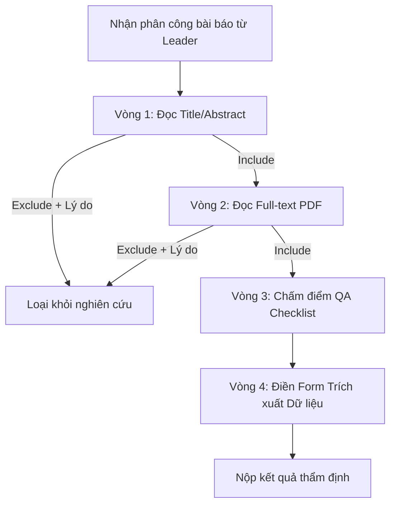

# Cẩm Nang Chi Tiết Về Vai Trò Reviewer (Người Thẩm Định / Phản Biện SLR)

Tài liệu này tổng hợp toàn bộ các tuyến đường (Routes), quyền hạn, chức năng và quy trình thao tác dành riêng cho người dùng giữ vai trò **Reviewer (Thành viên thẩm định / Phản biện)** trong Hệ thống Theo dõi Xu hướng & Tổng quan Tài liệu Khoa học (**SLRS - ResearchPulse**).

---

## 1. Tổng Quan Về Vai Trò Reviewer

Trong phương pháp luận nghiên cứu **Systematic Literature Review (SLR)** theo chuẩn Kitchenham và PRISMA:
* **Reviewer (hoặc Screener / Extractor)** là nhân tố cốt lõi trực tiếp thẩm định tài liệu khoa học một cách độc lập và khách quan.
* Nhằm đảm bảo tính khách quan khoa học, Reviewer tham gia vào cơ chế **Sàng lọc độc lập (Blind / Double-blind Review)**: Không thấy trước đánh giá của phản biện viên khác nhằm tránh thiên vị (Bias).
* Đóng góp trực tiếp vào 4 giai đoạn xử lý bài báo:
  1. **Sàng lọc Tiêu đề & Tóm tắt (Title & Abstract Screening)**.
  2. **Sàng lọc Toàn văn (Full-Text Screening)**.
  3. **Đánh giá chất lượng (Quality Assessment - QA)**.
  4. **Trích xuất dữ liệu (Data Extraction)**.

---

## 2. Bản Đồ Tuyến Đường (Route Map) Dành Cho Reviewer

Reviewer trong hệ thống mang mã vai trò nội bộ là **Role 2 (`MEMBER / REVIEWER`)**. Khi truy cập các đường dẫn của dự án, hệ thống sẽ tự động điều hướng Reviewer vào không gian làm việc chuyên biệt (Workspace):

| Tuyến đường (Route URL) | Tên Component | Chức năng thực tế của Reviewer |
| :--- | :--- | :--- |
| `/projects` | `ProjectListPage` | Xem danh sách các đề tài mà mình được mời tham gia với vai trò Reviewer. |
| `/projects/:projectId/overview` | `ProjectDetailPage` | Xem đề cương nghiên cứu: Đề tài, mục tiêu, khung PICO-C, danh sách câu hỏi RQs do Leader thiết lập *(chỉ xem, không sửa)*. |
| `/projects/:id/workspace` | `ReviewProcessWorkspace` | Xem tiến độ tổng thể của quy trình phản biện và trạng thái mở/đóng của từng giai đoạn. |
| `.../identification/:identificationPhaseId` | `IdentificationPhaseWorkspace` | Xem danh mục các nguồn cơ sở dữ liệu (IEEE, Scopus...) và số lượng bài đã thu thập. |
| `.../screening/:screeningProcessId` | `TitleAbstractScreeningWorkspace` | **Không gian làm việc chính (Vòng 1)**: Hệ thống tự động chuyển thẳng Reviewer vào giao diện đọc và sàng lọc Tiêu đề/Tóm tắt từng bài. |
| `.../full-text-screening/:screeningProcessId` | `FullTextScreeningWorkspace` | **Không gian làm việc Vòng 2**: Đọc file toàn văn (PDF/Link), kiểm tra tiêu chuẩn lựa chọn sâu và nộp quyết định. |
| `.../quality-assessment/:qualityAssessmentId` | `QualityAssessmentWorkspace` | **Không gian Đánh giá chất lượng**: Trả lời bảng kiểm (QA Checklist) chấm điểm độ tin cậy và phương pháp nghiên cứu của bài báo. |
| `.../extraction/workspace/:studyId` | `DataExtractionPhaseWorkspace` | **Không gian Trích xuất dữ liệu**: Đọc bài báo và điền biểu mẫu trích xuất các trường thông tin (Author, Findings, Metrics, Answers to RQs). |
| `.../extraction/grid` | `ExtractionGridWorkspace` | Xem bảng ma trận dữ liệu đã trích xuất từ các bài báo đã được chấp thuận. |

---

## 3. Chi Tiết Các Nhiệm Vụ & Thao Tác Cốt Lõi Của Reviewer

### 3.1. Sàng Lọc Tiêu Đề & Tóm Tắt (Title & Abstract Screening)
* **Giao diện làm việc**: `TitleAbstractScreeningWorkspace`.
* **Cơ chế**:
  * Reviewer duyệt qua danh sách các bài báo được phân công cho riêng mình (Assigned List).
  * Đọc Tiêu đề (Title), Tóm tắt (Abstract), Từ khóa (Keywords) và Tác giả.
* **Hành động ra quyết định**:
  1. **Include (Nhận)**: Bài báo phù hợp với mục tiêu đề tài và tiêu chí PICO-C -> Chuyển vào vòng trong.
  2. **Exclude (Loại trừ)**: Bắt buộc chọn một **Lý do loại trừ (Exclusion Reason)** từ thư viện định sẵn (ví dụ: *Không đúng bối cảnh, Sai công nghệ, Nghiên cứu ngắn thiếu dữ liệu...*) và có thể thêm ghi chú chi tiết (Notes).
* **Tính bảo mật (Blind Review)**: Reviewer không thấy quyết định của bạn phản biện song song (Reviewer 2) nhằm ngăn chặn hiện tượng làm theo số đông.

### 3.2. Sàng Lọc Toàn Văn (Full-Text Screening)
* **Giao diện làm việc**: `FullTextScreeningWorkspace`.
* Áp dụng cho các bài báo đã vượt qua vòng lọc Tiêu đề & Tóm tắt.
* **Cơ chế**:
  * Mở trình xem PDF trực tiếp trên web hoặc theo liên kết DOI.
  * Đọc chi tiết phương pháp, thuật toán, kiến trúc hệ thống và kết quả thực nghiệm.
  * Điền bảng tiêu chí sàng lọc toàn văn (Study Selection Checklist).
  * Đưa ra quyết định cuối cùng ở cấp độ toàn văn: **Include** hoặc **Exclude** kèm căn cứ khoa học.

### 3.3. Đánh Giá Chất Lượng Nghiên Cứu (Quality Assessment - QA)
* **Giao diện làm việc**: `QualityAssessmentWorkspace`.
* **Cơ chế chấm điểm**:
  * Reviewer sử dụng bảng câu hỏi đánh giá chất lượng (QA Checklist) đã được áp dụng cho đề tài (ví dụ: bộ câu hỏi Dybå & Dingsøyr cho nghiên cứu thực nghiệm).
  * Chấm điểm từng câu hỏi theo thang điểm quy định (Ví dụ: `Yes = 1`, `Partially = 0.5`, `No = 0`).
  * Hệ thống tự động tính tổng điểm chất lượng (Quality Score) của bài báo.
  * Chỉ những bài báo vượt qua ngưỡng điểm chuẩn (Threshold) mới được bước vào giai đoạn trích xuất dữ liệu.

### 3.4. Trích Xuất Dữ Liệu Nghiên Cứu (Data Extraction)
* **Giao diện làm việc**: `DataExtractionPhaseWorkspace`.
* **Thao tác điền biểu mẫu (Form Extraction)**:
  * Reviewer làm việc trên luồng của mình (`Reviewer 1 Thread` hoặc `Reviewer 2 Thread`).
  * Trích xuất các trường thông tin theo cấu trúc Form:
    * **Thông tin thư mục**: Tác giả, năm, tên tạp chí/hội nghị, quốc gia.
    * **Thông tin kỹ thuật**: Ngôn ngữ lập trình, kiến trúc, tập dữ liệu (dataset), công cụ sử dụng.
    * **Câu trả lời cho các Research Questions (RQs)**: Ghi lại phát hiện từ bài báo trả lời cho RQ1, RQ2, RQ3...
  * Bấm **Save Draft** để lưu tạm hoặc **Submit Extraction** để hoàn tất việc trích xuất bài đó.

---

## 4. Ma Trận Phân Quyền Giữa Reviewer và Project Leader

| Thao tác / Quyền hạn | Project Leader (Role 1) | Reviewer (Role 2) |
| :--- | :---: | :---: |
| Chỉnh sửa Protocol (PICO-C, RQs, Objectives) | :white_check_mark: Toàn quyền | :no_entry_sign: Chỉ xem |
| Import bài báo (BibTeX, DOI, Scopus, IEEE) | :white_check_mark: Có quyền | :no_entry_sign: Không có quyền |
| Phân công bài báo cho các thành viên | :white_check_mark: Có quyền | :no_entry_sign: Không có quyền |
| Đóng/Mở giai đoạn phản biện (Start/Complete Phase) | :white_check_mark: Có quyền | :no_entry_sign: Không có quyền |
| **Sàng lọc Tiêu đề & Tóm tắt bài được giao** | :white_check_mark: Có thể làm | :white_check_mark: **Nhiệm vụ chính** |
| **Sàng lọc Toàn văn (Full-Text) bài được giao** | :white_check_mark: Có thể làm | :white_check_mark: **Nhiệm vụ chính** |
| **Chấm điểm QA Checklist bài được giao** | :white_check_mark: Có thể làm | :white_check_mark: **Nhiệm vụ chính** |
| **Điền Form Trích xuất dữ liệu (Data Extraction)** | :white_check_mark: Có thể làm | :white_check_mark: **Nhiệm vụ chính** |
| Giải quyết Xung đột (Resolve Conflict Decision) | :white_check_mark: **Quyền đặc quyền** | :no_entry_sign: Không có quyền |
| Xem bảng thống kê hiệu suất cá nhân của từng người | :white_check_mark: Xem tất cả | :white_check_mark: Chỉ xem tiến độ của mình |
| Mời hoặc xóa thành viên khỏi dự án | :white_check_mark: Có quyền | :no_entry_sign: Không có quyền |

---

## 5. Trải Nghiệm Người Dùng (UX Flow) Dành Cho Reviewer

1. **Đăng nhập**: Reviewer đăng nhập bằng tài khoản thành viên (VD: tài khoản test của screener).
2. **Chọn đề tài**: Vào menu **Projects**, chọn đề tài nghiên cứu đã được thêm vào.
3. **Vào quy trình (Review Process)**: Bấm vào tab **Review Process** hoặc nút hành động trên màn hình Overview.
4. **Hệ thống tự nhận diện**: Nhờ cơ chế `ScreeningPhaseRouter`, hệ thống phát hiện vai trò `Role = 2` và tự động mở thẳng màn hình thẩm định bài báo, Reviewer không cần trải qua các bước cấu hình phức tạp của Leader.
5. **Thao tác tập trung (Distraction-Free)**: Giao diện thẩm định bài báo tập trung tối đa vào nội dung bài, nút bấm Include/Exclude trực quan và phím tắt hỗ trợ thao tác nhanh.
